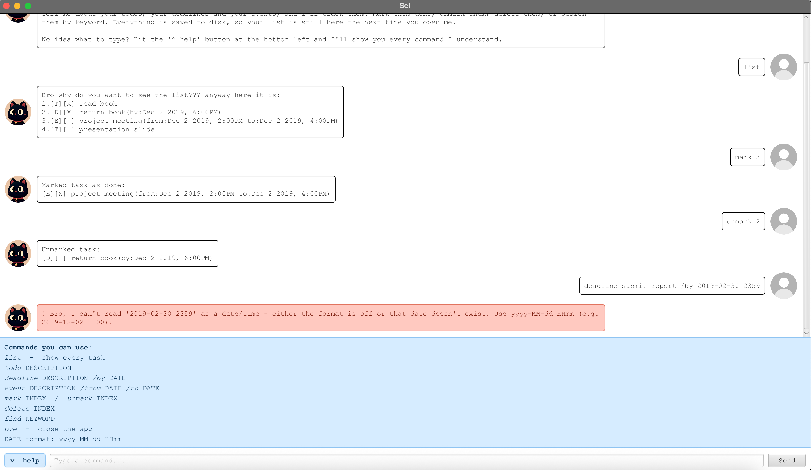

# Sup, I'm Sel

# Here's my user guide



I am a **desktop chatbot for keeping your task list in order**. 

You insert a task, I keep track of it.

I track 3 kinds of tasks: 
1. **todos**
2. **deadlines** that due at a
certain time
3. **events** that run between two times

You can mark them done, delete them, and search them. Everything is saved to disk as you go, so
your list is still there the next time you open the app.

## Contents

- [Getting started](#getting-started)
- [Understanding my replies](#understanding-my-replies)
- [Dates and times](#dates-and-times)
- [Features](#features)
  - [Adding a todo: `todo`](#adding-a-todo-todo)
  - [Adding a deadline: `deadline`](#adding-a-deadline-deadline)
  - [Adding an event: `event`](#adding-an-event-event)
  - [Listing every task: `list`](#listing-every-task-list)
  - [Marking a task done: `mark`](#marking-a-task-done-mark)
  - [Marking a task not done: `unmark`](#marking-a-task-not-done-unmark)
  - [Deleting a task: `delete`](#deleting-a-task-delete)
  - [Searching: `find`](#searching-find)
  - [Exiting: `bye`](#exiting-bye)
  - [Saving your tasks](#saving-your-tasks)
- [Something I will not let you do](#something-i-will-not-let-you-do)
- [Troubleshooting](#troubleshooting)
- [Command summary](#command-summary)
- [Known limitations](#known-limitations)

## Getting started

> [!IMPORTANT]
> **Java 25** is needed. Check with `java -version`. On macOS with SDKMAN,
> switch to it using `sdk use java 25.0.3.fx-zulu`.

**Option 1 — run from the source folder.** Quickest way while you
are working on the code:

```
./gradlew run
```

**Option 2 — build a standalone jar.** This bundles JavaFX, so the jar runs on
its own:

```
./gradlew shadowJar
java -jar build/libs/ip-all.jar
```

Either way, the chat window opens in the middle of your screen at about half
its width and two thirds its height. Drag any edge to resize it: the chat and
the input box follow the new size.

To get going, type a command in the box at the bottom and press <kbd>Enter</kbd>
(or click **Send**):

```
todo read book
```

> [!TIP]
> Forgotten a command? Click the **`^ help`** button at the bottom left. A blue
> panel slides up listing every command, with the words you actually type shown
> in _italics_. Click it again to tuck it away.

## Understanding my replies

I print each task with two boxes in front of it:

```
[D][X] return book(by:Dec 2 2019, 6:00PM)
 ↑  ↑
 │  └─ X means done, blank means not done yet
 └──── task type
```

| Box | Meaning |
| :-- | :------ |
| `[T]` | **Todo** |
| `[D]` | **Deadline** — due at one date and time |
| `[E]` | **Event** — runs from one date and time to another |
| `[X]` | Done |
| `[ ]` | Not done |

When something goes wrong, the reply appears in a **light red bubble starting
with `!`** instead of the usual white one. Nothing is added, changed or deleted
when you see one, so it is always safe to fix your command and try again.

## Dates and times

**Deadlines** and **events** need a **date AND time**, written like this:

```
yyyy-MM-dd HHmm
```

The time is on a 24-hour clock, with no colon. So `2019-12-02 1800` is 2 Dec
2019 at 6pm, and `2019-12-02 0930` is half past nine that morning. I display
it back to you in a friendlier form, `Dec 2 2019, 6:00PM`.

> [!WARNING]
> I do check the actual calendar rather than just the format of what you typed. Dates
> that do not exist are **rejected**: `2019-02-30`,
> `2019-04-31` and the time `2400` are all refused, and `2019-02-29` is refused
> because 2019 was not a leap year.

## Features

> **NOTE**
> Command words are lowercase: `todo` works, `Todo` and `TODO` do not.
> Extra spaces are harmless — `   todo    read    book   ` is understood as
> `todo read book`, and the description is stored with single spaces.

### Adding a todo: `todo`

Adds a task with no date attached.

**Format:** `todo DESCRIPTION`

**Example:** `todo read book`

```
Why more work for you?!?!
[T][ ] read book
Now 1 task(s) on your list bruh...
```

### Adding a deadline: `deadline`

Adds a task that is due at a certain date and time.

**Format:** `deadline DESCRIPTION /by DATE`

**Example:** `deadline return book /by 2019-12-02 1800`

```
Why more work for you?!?!
[D][ ] return book(by:Dec 2 2019, 6:00PM)
Now 2 task(s) on your list bruh...
```

### Adding an event: `event`

Adds a task that runs between two dates and times.

**Format:** `event DESCRIPTION /from START /to END`

**Example:** `event project meeting /from 2019-12-02 1400 /to 2019-12-02 1600`

```
Why more work for you?!?!
[E][ ] project meeting(from:Dec 2 2019, 2:00PM to:Dec 2 2019, 4:00PM)
Now 3 task(s) on your list bruh...
```

`/from` has to come before `/to`, and the event has to **start before it ends**.
An event that ends earlier than it starts, or at the very same moment, is
refused.

### Listing every task: `list`

Shows everything on your list, numbered. Those numbers are what `mark`,
`unmark` and `delete` refer to.

**Format:** `list`

```
Bro why do you want to see the list??? anyway here it is:
1.[T][ ] read book
2.[D][ ] return book(by:Dec 2 2019, 6:00PM)
3.[E][ ] project meeting(from:Dec 2 2019, 2:00PM to:Dec 2 2019, 4:00PM)
```

### Marking a task done: `mark`

Ticks off the task at the given number.

**Format:** `mark INDEX`

**Example:** `mark 1`

```
Marked task as done:
[T][X] read book
```

### Marking a task not done: `unmark`

Un-ticks a task you had marked done.

**Format:** `unmark INDEX`

**Example:** `unmark 1`

```
Unmarked task:
[T][ ] read book
```

### Deleting a task: `delete`

Removes the task at the given number for good.

**Format:** `delete INDEX`

**Example:** `delete 2`

```
Yay! You have fewer tasks now!
[D][ ] return book(by:Dec 2 2019, 6:00PM)
Now 2 task(s) on your list bruh...
```

> [!CAUTION]
> **There is no undo.** Deleting is immediate and is saved to disk straight away.
> Run `list` first if you are not certain which number you want.

### Searching: `find`

Shows only the tasks whose description matches your keywords.

**Format:** `find KEYWORD [MORE_KEYWORDS]`

Matching is **case-insensitive** and matches **parts of words**, so `find boo`
finds "read book". Give several keywords and a task has to contain **all** of
them, in any order — `find book read` still finds "read book".

**Example:** `find book`

```
Here are the matching tasks in your list:
1.[T][ ] read book
2.[D][ ] return book(by:Dec 2 2019, 6:00PM)
```

If nothing matches, I will say so:

```
Bro, nothing in your list matches that keyword :(
```

> **NOTE**
> The numbers in search results count the **matches**, not your whole list. To
> mark or delete something you found, run `list` and use the number shown there.

### Exiting: `bye`

Says goodbye, counts down from three, and closes the window.

**Format:** `bye`

```
Bye see ya later alligator.
```

Closing the window with its close button works as well, and your tasks are
already saved.

### Saving your tasks

**There is nothing to do here**: every change you make is saved to the file `data/sel.txt` next to wherever you started the app from.
The file and its folder are created for you on first run.

I write the new version to a temporary file and then moves it into place, so
if a save fails halfway through, your previous file is left untouched rather
than half-written.

The file is plain text, one task per line, and you can read it:

```
T | 0 | read book
D | 0 | return book | 2019-12-02T18:00
E | 0 | project meeting | 2019-12-02T14:00 | 2019-12-02T16:00
```

> [!WARNING]
> If you hand-edit that file and get a line wrong, Sel **skips just that line**
> and loads the rest, then tells you what it skipped when it starts:
>
> ```
> ! Heads up: there was a line in my save file I couldn't use
> (line 2: 'garbage' is not a done/not-done flag), so I skipped it.
> Everything else loaded fine.
> ```
>
> The skipped line is gone from the file the next time Sel saves, so copy the
> file first if you want to repair it by hand.

## Something I will not let you do

These are refused on purpose, each with a message explaining why:

| You typed | Why I refuse |
| :-------- | :-------------- |
| The same task twice | A task counts as a duplicate when it is the same kind, has the same description ignoring capitals, and has the same dates. `todo read book` twice is refused; `todo read book` and `todo READ BOOK` are the same task; two deadlines with the same name but different dates are fine. |
| `mark` on a task already done | Nothing would change, so Sel says so instead of writing to disk for nothing. The same goes for `unmark` on a task that was never done. |
| `list all`, `bye now` | `list` and `bye` take nothing after them, so anything extra is likely a typo. |
| `mark 0`, `mark 99` | Task numbers start at 1 and stop at the length of your list. Sel tells you the range you can use. |
| A `\|` in a description | That character separates the fields in the save file, so a description containing it could not be read back reliably. |
| `/by` or `/from` given twice | A deadline has exactly one due date and an event exactly one start and one end. |

## Troubleshooting

<details>
<summary><b>I say "Rephrase your words, no idea what u mean bro."</b></summary>

The first word was not a command I know. Check the spelling and the
capitals — `Todo` is not `todo`. Click **`^ help`** for the full list.
</details>

<details>
<summary><b>Your date keeps getting rejected</b></summary>

The format is `yyyy-MM-dd HHmm`: four-digit year first, dashes between the date
parts, then a space and a four-digit 24-hour time with no colon.

| Rejected | Why | Use |
| :------- | :-- | :-- |
| `02-12-2019 1800` | Day put first | `2019-12-02 1800` |
| `2019-12-02` | No time | `2019-12-02 1800` |
| `2019-12-02 6pm` | Not a 24-hour time | `2019-12-02 1800` |
| `2019-12-02 2400` | There is no hour 24 | `2019-12-03 0000` |
| `2019-02-30 1800` | February has no 30th | a date that exists |
</details>

<details>
<summary><b>I say it couldn't save your tasks</b></summary>

Your list is still correct in the window, but it could not be written to disk,
so it will not survive a restart. The usual causes are a read-only folder or a
missing permission on `data/sel.txt`. The message names the exact path — check
that you can write to it, then repeat your last command.
</details>

<details>
<summary><b>My tasks disappeared</b></summary>

I look for `data/sel.txt` **relative to the folder you started it from**, so
launching it from somewhere else shows an empty list. Start it from the same
folder as before, or move `data/sel.txt` alongside it.
</details>

## Command summary

| Action | Format | Example |
| :----- | :----- | :------ |
| **Add todo** | `todo DESCRIPTION` | `todo read book` |
| **Add deadline** | `deadline DESCRIPTION /by DATE` | `deadline return book /by 2019-12-02 1800` |
| **Add event** | `event DESCRIPTION /from START /to END` | `event project meeting /from 2019-12-02 1400 /to 2019-12-02 1600` |
| **List all** | `list` | `list` |
| **Mark done** | `mark INDEX` | `mark 1` |
| **Mark not done** | `unmark INDEX` | `unmark 1` |
| **Delete** | `delete INDEX` | `delete 2` |
| **Search** | `find KEYWORD [MORE_KEYWORDS]` | `find book` |
| **Exit** | `bye` | `bye` |

Dates are written `yyyy-MM-dd HHmm`, for example `2019-12-02 1800`.

## Known limitations

- **No editing.** To change a task, delete it and add it again.
- **No undo.** `delete` is immediate and permanent.
- **`|` cannot appear in a description**, because the save file uses it to
  separate fields.
- **Repeated spaces inside a description are collapsed** to one, so
  `todo read    book` is stored as "read book".
- **Command words are case-sensitive** and must be lowercase.
- **Task numbers shift** when you delete something: deleting task 1 makes the
  old task 2 into the new task 1. Run `list` before using a number you are
  unsure about.
- **`find` searches descriptions only**, not dates.
